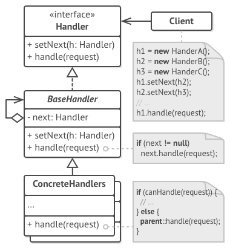
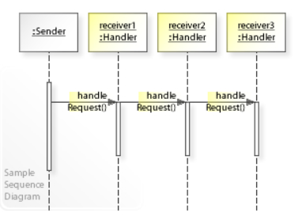
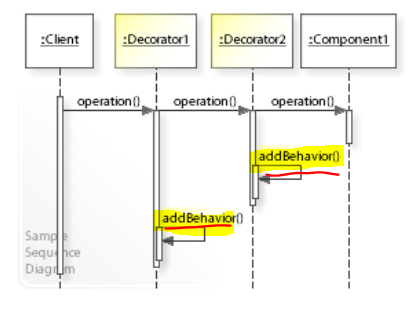

# Chain of Responsibility

Avoid coupling the sender of a request to its receiver by giving more than one object (Middleware) a chance to handle the request. Chain the receiving objects and pass the request along the chain until an object handles it.

## Problem

* Coupling the sender of a request to its receiver should be avoided
* It should be possible that *more than one receiver* can handle a request and handler isn't known a priori.

## Solution

Define a chain of receiver objects having the responsibility to either handle a request or forward it to the next receiver on the chain (if any).

## Common Structure

*Source: Refactoring.Guru*

* Handler & BaseHandler
  * defines an interface for handling requests
  * (optional) implements the successor link
* ConcreteHandler
  * handles requests it is responsible for; otherwise it forwards the requests to its successor
* Client
  * initiates the request to a ConcreteHandler object on the chain.

## Collaboration

*Source: javaobsession.wordpress.com*

* When a client issues a request, the request propagates along the chain until a ConcreteHandler object takes responsibility for handling it.

## Benefits

* Reduces coupling between senders of requests and their receivers
  * Every handler keeps only a single reference to its successor.
* Added flexibility in assigning responsibilities to objects
  * Responsibilties can be added or changed at run-time.
* Follows the Single Responsibility Principle

## Drawbacks

* Some requests may end up unhandled
  * Since a request has no explicit receiver, there is no guarantee it'll be handled

## Example

**Definition**

**Usage**

## Comparison with other patterns

* **Composite** - Chain of responsibility is often applied in conjuction with Composite. In this case, a component's parent can act as its successor.

* **Decorator** - has very common sequence diagram. They both rely on the recursive `composition` to pass execution through **a series of objects**. 

However, Chain of Responsibility handlers can execute arbitrary actions, independent of each other. They can also terminate further chaining of the request at will. On the other hand, `Decorator` extends a particular behavior and suppose to keep its interface consistent. Furthermore, Decorators are not allowed to break the execution chain at will.

Sequence Diagram of Decorator Pattern

