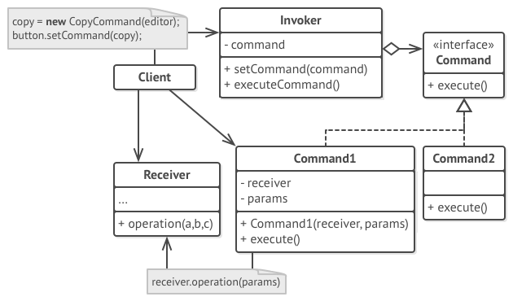

# Command Pattern

Encapsulate a request as a stand-alone object, which can be used to
- parameterize clients with different requests
- queue or log requests
- support undoable operations

## Problem

- Coupling the invoker of a request to a particular request should be avoided.

## Solution

- Define separate `Command` objects that encapsulate a request.
- A class delegates a request to a command object instead of implementing a particular request directly.

## Common Structure

*Source: Refactoring.Guru*

* Command
  * declares an interface for executing an operation
* ConcreteCommand
  * defines a binding between a Receiver object and an action.
  * implements `Execute` by invoking the corresponding operation(s) on Receiver.
* Client
  * creates a ConcreteCommand object and sets its receiver and params.
* Invoker
  * asks the `Command` to execute the request.
* Receiver
  * knows how to perform the operations. Any class may serve as Receiver.

## Collaboration

*Source: http://www.cs.mcgill.ca*

* When commands are undoable, ConcreteCommand stores state for undoing the command prior to invoking `Execute`.

## Benefits

* Decouples classes that invoke operations from the one that knows how to perform it.
* Extensibility: Commands are first-class objects. They can be manipulated and extended. It is easy to add new commands.
* Allows assembling simple commands into larger ones --> composite command

## Drawbacks

* Increases overall code complexity by creating multiple additional classes.

## Example

**Definition**

**Usage**

## Comparison with other patterns

* **Memento** can keep state the command requires to undo its effect.

* **Composite** can be used to implement MacroCommands.

* **Prototype** can help when you need to save copy of the Command into history.

* **Chain of Responsibility** passes a request sequentially along a dynamic chain of receivers. Command establishes a *one-directional* connection from senders to receivers.

* **Mediator** has senders and receivers reference each other indirectly.
Command holds the reference of a receiver only.

* **Observer** passes a request to all receivers *at the same time* but allows them to subscribe and unsubscribe from receiving further requests dynamically.