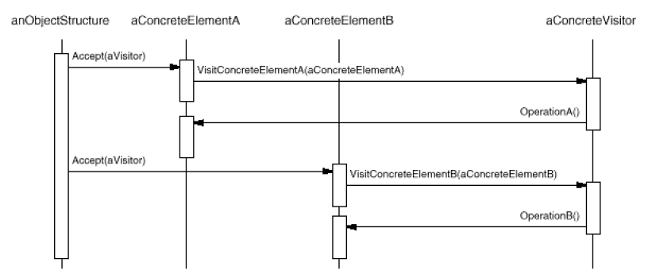

# Visitor Pattern

Visitor lets you define a new operation without changing the classes of the elements on which it operates.

## Problem

- An object structure contains many unrelated classes with different interfaces. You want to perform operations on those objects that depend on their concrete classes.
- You need to add new opeations frequently and it is inflexible to add new subclasses each time a new operation is required.
- Distributing all these operations across the various node classes leads to a system that's hard to understand, maintain and change.

## Solution

- Define a separate `Visitor` object that implements an operation to be performed on elements of an object structure.
- Clients traverse the object structure and calls the visitor to perform the operation on the element.

## Common Structure

* Visitor
  * declares a visit operation for each class of ConcreteElement, e.g. `VisitConcreteElementA()`.
* ConcreteVisitor
  * implements each operation declared by Visitor.
  * provides the context for the algorithm and stores its local state. This state often accumulates results during the traversal of the structure.
* Element
  * defines an `Accept()` operation that takes a visitor as an argument.
* ConcreteElement
  * implements an Accept operation
* ObjectStructure
  * can enumerate its elements
  * may provide a high-level interface to allow the Client to visit its elements.

## Collaboration

* A client must create a ConcreteVisitor object and then traverse the object structure and visits each element with that concrete visitor.
* When an element is visited, it calls the Visitor operation and supplies itself as an argument to let the visitor access its state, if necessary.

## Benefits

* New operations can be added easily.
* Moves related behaviors into a visitor.
  * That simplifies both the elements and the algorithms defined in the visitors.
* Accumulating state
  * Without a visitor, the state should be passed as extra argument or stored as global variables.

## Drawbacks

* Adding new `ConcreteElement` classes is hard. 
  * For each new ConcreteElement, new operations `VisitConcreteElementX()` should be implemented in ConcreteVisitor.
* Breaking encapsulation
  * Element should provide *public operations* to access its internal state, so that the Visitors can do their job. 

## Example

**Definition**

**Usage**

## Comparison with other patterns

* **Composite** - Visitors can be used to apply an operation over entire Composite tree.
* **Interpreter** - Visitor may be applied to do the interpretation.