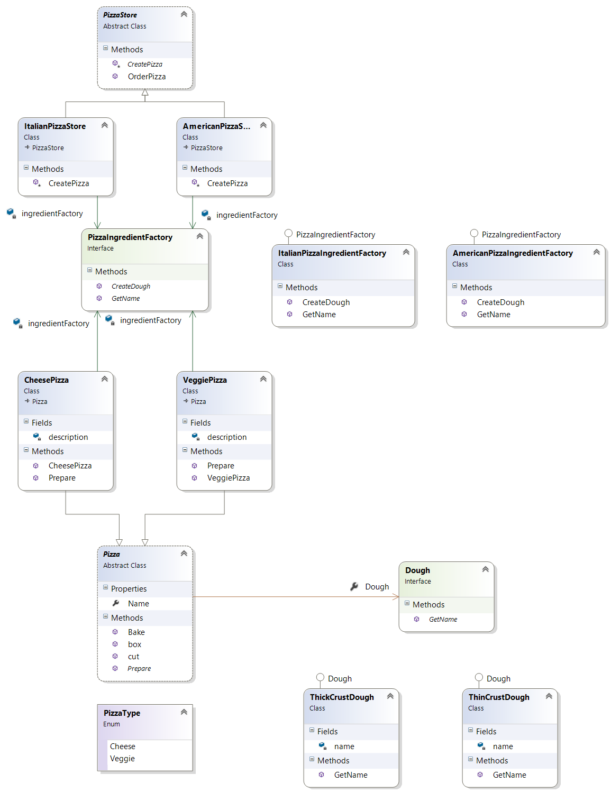

# Abstract Factory

The Abstract Factory Pattern provides an interface for creating families of related or dependent objects without specifying their concrete classes.

## Problem

* Creating objects directly within the class that requires the object is inflexible
* Changing the instantiation later without chaging the class is impossible
* The created object cannot be reused
* The created object is tightly coupled with the class and it makes the class hard to test because real objects can't be replaced with mock objects.

## Solution

* Encapsulate object creation in a separate (factory) object. That is, define an interface (AbstractFactory) for creating objects, and implement the interface.
* A class delegates object creation to a factory object instead of creating objects directly.

## Common Structure


* AbstractFactory (PizzaIngredientFactory)
  * declares an interface for operations that create abstract products
* ConcreteFactory (ItalianPizzaIngredientFactory, AmericanPizzaIngredientFactory)
  * implements the operations to create concrete product objects
* AbstractProduct  (Dough)
  * declares an interface for a type of product object
* ConcreteProduct(ThinCrustDough, ThickCrustDough)
  * defines a product object to be created by the corresponding concrete factory
  * implements the AbstractProduct interface

## Collaboration

TODO - Add sequence diagram

* Normally a single instance of a ConcreteFactory class is created at runtime.

## Benefits

* Avoids tight coupling between concrete products and code that uses them.
* Allows building families of product objects and guarantees their compatibility and consistency.
* Divides responsibilities between multiple classes.

## Drawbacks

* Increases overall code complexity by creating multiple additional classes.
* Supporting new kinds of products is difficult.
  * It requires extending the AbstractFactory interface, which involves changing all of its subclasses.

## Example

**Definition** - AbstractFactory and ConcreteFactory
```cs
    public interface PizzaIngredientFactory
    {
        Dough CreateDough();
    }

    public class AmericanPizzaIngredientFactory : PizzaIngredientFactory
    {
        public Dough CreateDough()
        {
            return new ThickCrustDough();
        }
    }

    public class ItalianPizzaIngredientFactory : PizzaIngredientFactory
    {
        public Dough CreateDough()
        {
            return new ThinCrustDough();
        }
    }
```

**Definition** - AbstractProduct and ConcreteProduct
```cs
    public interface Dough
    {
        string GetName();
    }

    public class ThickCrustDough : Dough
    {
        public string GetName()
        {
            return "Extra thick crust dough";
        }
    }

    public class ThinCrustDough : Dough
    {
        public string GetName()
        {
            return "Thin crust dough";
        }
    }
```



**Usage**
```cs
    public class AmericanPizzaStore : PizzaStore
    {
        // AmericanPizzaStore creates the corresponding ingriedient factory.
        private PizzaIngredientFactory ingredientFactory = new AmericanPizzaIngredientFactory();

        protected override Pizza CreatePizza(PizzaType type)
        {
            switch (type)
            {
                case PizzaType.Cheese:
                    // the correct ingredientFactory is transferred when creating a pizza
                    return new CheesePizza(ingredientFactory);
                case PizzaType.Veggie:
                    return new VeggiePizza(ingredientFactory);
                default:
                    throw new NotImplementedException();
            }
        }
    }
```

## Relations with Other Patterns

* **Factory Method** - AbstractFactory classes are often implemented with factory methods, but they can also be implemented using **Prototype**.

* **Singleton** - A concrete factory is often a singleton.