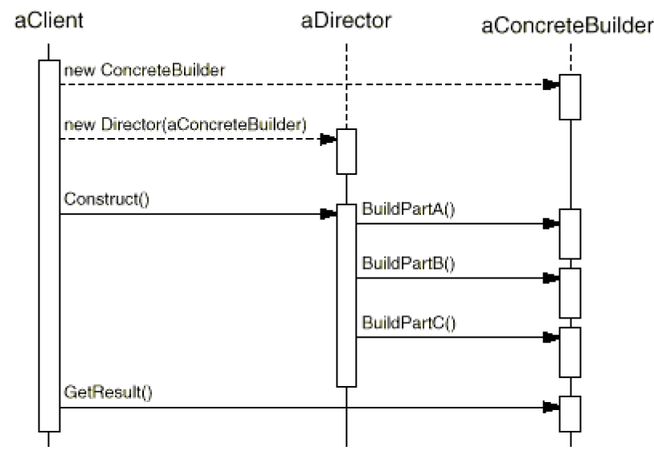

# Builder Pattern

Builder produces different types and representations of an object using the same building process. Builder allows constructing complex object step by step.

## Problem

* How can a class create different representations of a complex object?
* How can a class that includes creating a complex object simplified?
    * Constructor with lots of (optional) parameters is not convenient.
    * Constructor overloading with different parameters will be useless in most cases.
    * Creating subclasses with all combinations of the parameters will be tedious.

Creating and assembling the parts of a complex object within a class is inflexible and make it impossible to change the representation later independently from (without having to change) the class.

## Solution

* Encapsulate creating and assembling the parts of a complex object in a separate `Builder` object.
* A class delegates object creation to a `Builder` object instead of creating the objects directly.

A class can delegate to different `Builder` objects to create different representations of a complex object.


*Source*: SourceMaking.com

## Common Structure


* Builder
  * declares steps required to build a product
* ConcreteBuilder
  * provides implementation for Builder. It is an object able to construct and assemble parts to build other objects.
* Product
  * is an object created as result of construction.
* Director
  * constructs products using a `Builder` object.

> Builder pattern does not require Director class. The separate director class is handy when you have several product variants that require different construction process. Director can encapsulate all that code inside a single class.

## Collaboration



* The client creates the Director object and configures it with the desired Builder object.
* Director notifies the builder whenever a part of the product should be built.
* Builder handles requests from the director and adds parts to the product.
* The client retrieves the product from the builder.

## Benefits

* Different products can be built using the same code.
* Encapsulate code for construction and representation
* Isolates the complex construction code from a product's core business logic.
* Provides control over steps of construction process.

## Drawbacks

* Requires a separate ConcreteBuilder for each different type of Product
* Requires the builder classes to be mutable.

> Increases overall code complexity by creating multiple additional classes.

## Known uses

* StringBuilder - A mutable sequence of characters

## Example


**Usage**

```cs
        // Create a concrete builder
        var americanPizzaBuilder = new AmericanPizzaBuilder();
        
        // Create a director
        var waiter = new Waiter(americanPizzaBuilder);
        
        // Create a pizza
        var pizza = waiter.CreatePizza("Spinach+Olives");
```

## Comparison with other patterns

* Builders can produce products that do not belong to the same class hierarchy or interface. It is a key difference between the `Builder` and other creational patterns.

* **Abstract Factory** creates families of product objects (either simple or complex). Builder constructs a complex object step by step and returns the product as a final step, but the AbstractFactory returns the result immediately.

* **Composite** - Builder can be used to build a complex `Composite` tree step by step.