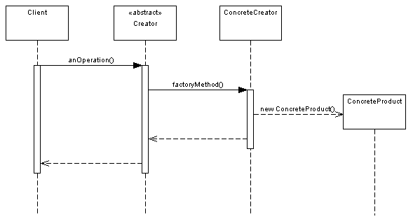

# Factory Method

The Factory Method Pattern defines an interface for creating an object, but lets subclasses decide which class to instantiate.

## Problem

* You should create a particular object (e.g. AmericanCheesePizza or ItalianVeggiePizza) depending on the type. 
* Creating a new object using `new` keyword and `if-else` conditionals in every place where you need is very inflexible. 

## Solution

* Define a separate operation `factory method` in the Creator class (e.g. CreatePizza() method in the AmericanPizzaStore class)
* Move the constructor call (`new AmericanCheesePizza()`) inside the factory method.

**Definition**
```cs
        // A facotry method
        //    1. is abstract so the subclass are counted on to handle object creation.
        //    2. returns a Product.
        //    3. isolates the client from knowing which concrete Product is actually created.
        //    4. may be parameterized (or not) to select among several variations of a product.
        protected abstract Pizza CreatePizza(PizzaType type);
```

## Common Structure


* Product (Pizza)
  * defines the interface of objects the factory method creates
* ConcreteProduct (ItalianCheesePizza, AmericanCheesePizza etc.)
  * implements the Product interface
* Creator  (PizzaStore)
  * declares the abstract factory method which returns an instance of type Product.
  * may call the factory method to return an instance (OrderPizza calls CreatePizza)
* ConcreteCreator(AmericanPizzaStore)
  * overrides the abstract factory method to return an instance of a ConcreteProduct (eg. AmericanCheesePizza)

## Collaborations


*Source: static.dzone.com*

* Creator/Factory relies on its subclasses to implement the factory method so that it returns an instance of the appropriate ConcreteProduct.

## Benefits

* Avoids tight coupling between concrete products and code that uses them.
* Simplifies code due to moving all creational code to one place.
* Simplifies adding new products to the program.

## Drawbacks

* Requires extra subclasses.

## Example Usage


```cs
            PizzaStore americanStore = new AmericanPizzaStore();
            Pizza pizza = americanStore.OrderPizza(PizzaType.Veggie);
            Console.WriteLine("Esposito ordered a " + pizza.Name);
            
            // Italian Pizza Store
            PizzaStore italianStore = new ItalianPizzaStore();
            Pizza pizza = italianStore.OrderPizza(PizzaType.Cheese);
            Console.WriteLine("Esposito ordered a " + pizza.Name);
```

## Relations with Other Patterns

* **Abstract Factory** is often implemented with Factory Methods. 

* **Templated Methods** - Factory methods are usually called within Template Methods.

* **Prototype** doesn't require subclassing, but it does require an `initialize()` operation. On the other hand, Factory Method requires subclassing, but doesn't require initialization step.