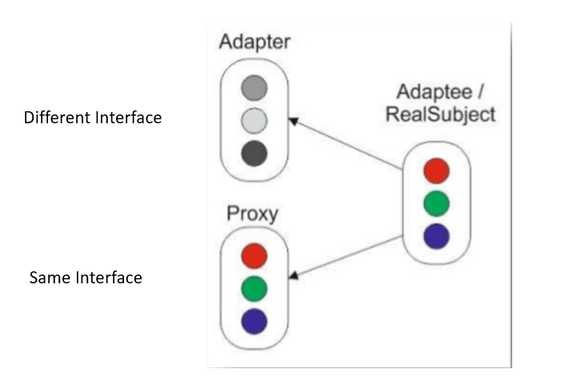
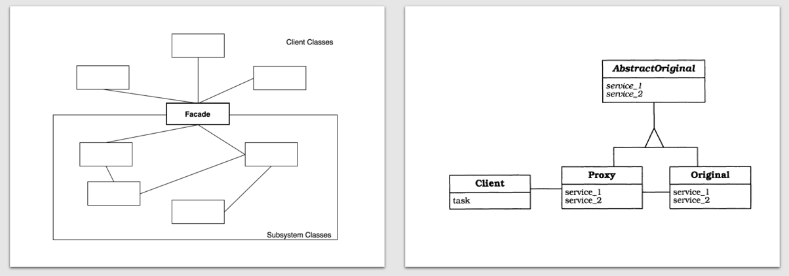
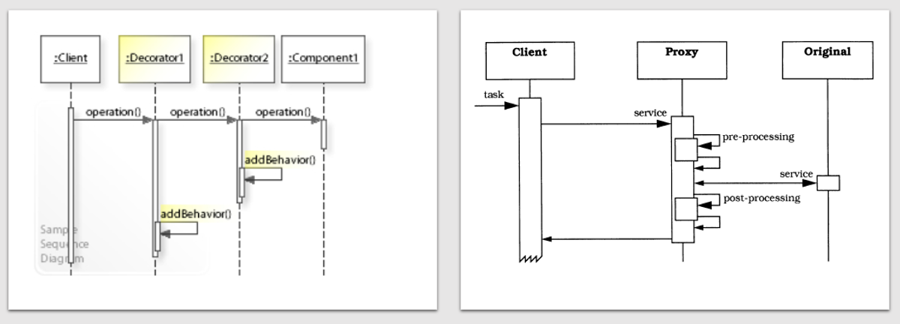

# Proxy

Provide a substitute or placeholder for another object to control access to it.

## Problem

* The access to an object should be controlled.
  * create an object only when it is needed.
  * check if clients have the needed access rights.
* Additional functionality should be provided when accessing an object.
  * marshal / unmarshal data

## Solution

Define a separate `Proxy` object that

* can be used as substitute for another object and
* implements the same interface (`Subject`) as an original service object with additional functionality to control the access to this subject.

## Common Structure

* Subject
  * defines the common interface for RealSubject and Proxy
* RealSubject
  * defines the real object that the proxy represents
* Proxy
  * maintains a reference to the real subject in order to access its operations.
  * provides an interface identical to Subject's so that a proxy can be substituted for the real subject.
  * controls access to the real subject and may be responsible for creating and deleting it.

## Collaboration

* Proxy forwards requests to RealSubject when appropriate, depending on the kind of proxy (see the sequence diagram above).

## Proxy variants

* *remote proxy*
  * is responsible for encoding a request and for sending the encoded request to the real subject in a different space.
* *virtual proxy*
  * may cache additional information about the real subject so that it can postpone creating an expensive object and accessing it (e.g. ImageProxy caches a thumbnail of a huge image) 
* *protection proxy*
  * checks if the caller has the required permissions to perform a request.

## Benefits

* Decoupling clients from the location of server components
  * Clients are not affected by migration of servers or changes in the networking infrastructure
  * Client code becomes more stable and reusable
* Enhanced efficiency and lower cost
  * *load-on-demand* strategy: avoid unnecessary loads from disk
  * Works even when the RealSubject is not ready
* Separation of housekeeping code from functionality
  * Manages the lifecycle of a RealSubject object (creation, deletion)

## Drawbacks

* Less efficiency due to indirection: All proxies introduce an additional layer of indirection.
* Overkill via sophisticated strategies: Be careful with intricate strategies for **caching** or **loading on demand** - they do not always pay.

## Example

**Definition**

**Usage**

## Comparison with other patterns

* **Adapter** provides a different interface to the object it adapts. Proxy provides the same interface as its subject.

* **Facade** provides a simplified interface to a larger complex system with more subsystems. Proxy provides a interface to a **single** object.

* **Decorator** can have similar implementations as proxies, but decorators have a different purpose. A decorator adds one or more responsibilities to an object at runtime, whereas the behavior of a proxy cannot be changed at runtime.

